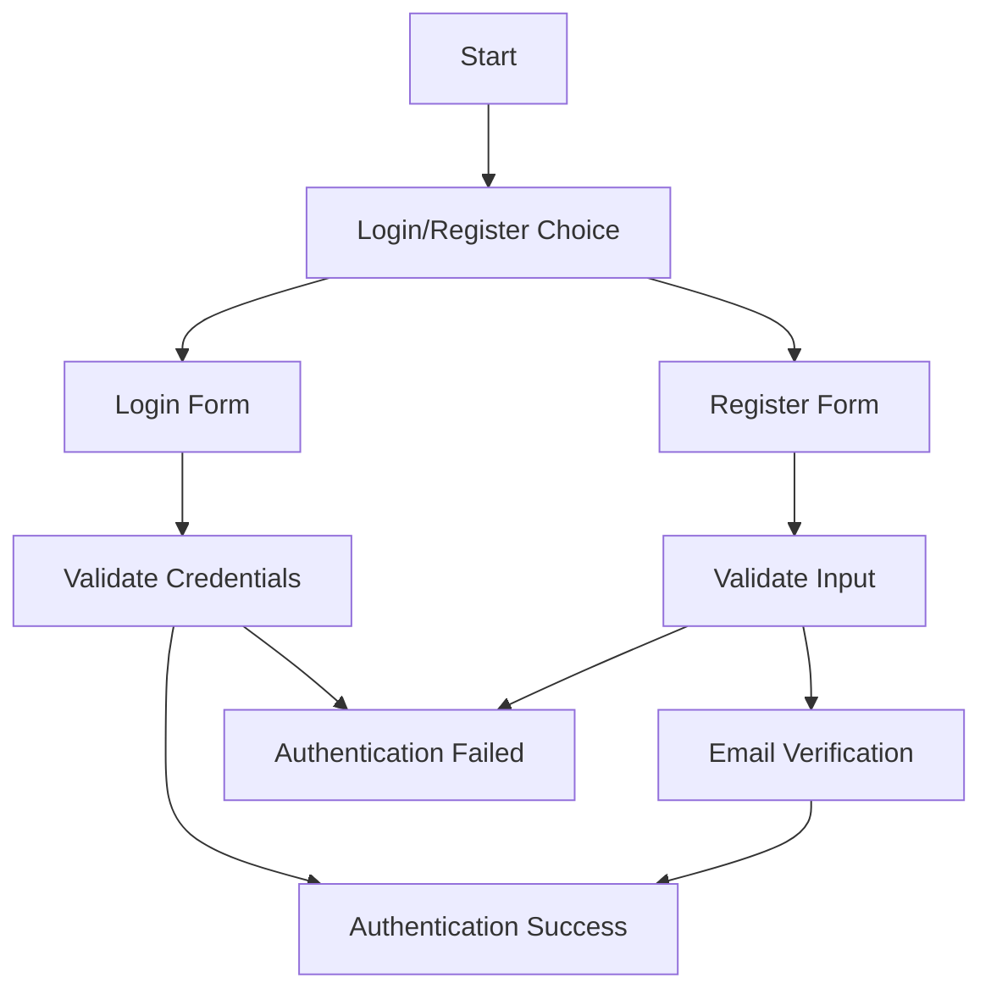
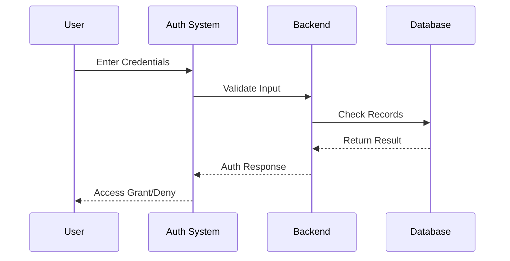
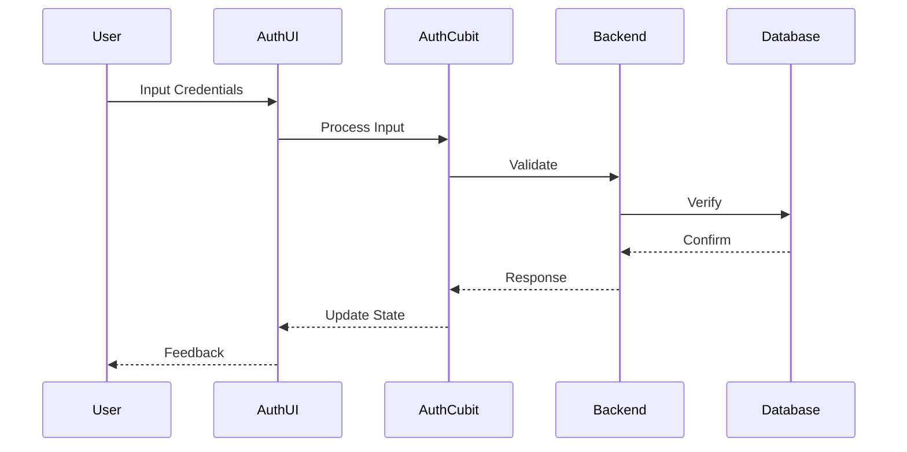
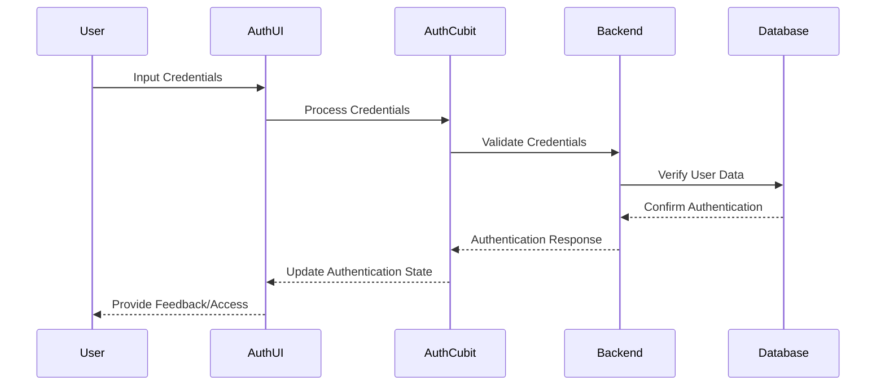
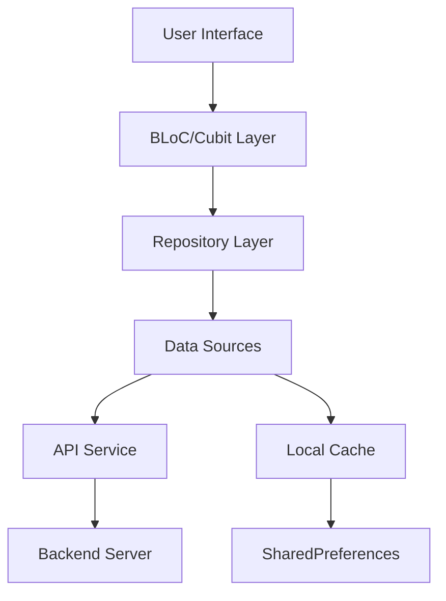

# Informant - Authentication System Documentation

## Project Overview

### Team Members
- Omar Ahmed
- Mohamed Ahmed
- Nour El-Din Saeed
- Mohamed Ahmed Azouz

### Supervisor
Dr. Mohamed Fakhry  
Faculty of Science, Ain Shams University

## Abstract

The Informant authentication system provides a secure and user-friendly mobile authentication platform. It features email verification, password recovery, and robust user registration with international phone number support. The system implements modern security practices and offers a seamless user experience through an intuitive interface with smooth animations and input validation.

## System Architecture

### Authentication Flow


### Key Components

1. **Login System**
   - Username/Email authentication
   - Password visibility toggle
   - "Remember Me" functionality
   - Password recovery flow

2. **Registration System**
   - Full name validation
   - Username uniqueness check
   - Password strength requirements
   - Email verification
   - International phone number support
   - Gender selection

3. **Email Verification**
   - OTP-based verification
   - Resend functionality
   - Timeout management

## Technical Implementation

### State Management
The application uses BLoC pattern through `AuthCubit` for managing authentication states:

```dart
sealed class AuthState {
  const AuthState();
}

class AuthInitial extends AuthState {}
class AuthLoading extends AuthState {}
class AuthSuccess extends AuthState {}
class AuthFailure extends AuthState {
  final String error;
  AuthFailure(this.error);
}
```

### User Interface

The UI implements a modern gradient design with responsive components:

- Gradient Background Colors:
  - Primary: Black
  - Secondary: Deep Blue (opacity: 0.8)
  - Tertiary: Black

- Animation Effects:
  - Fade-in transitions (1.5s duration)
  - Smooth state transitions
  - Loading indicators

### Security Features

1. **Password Management**
   - Secure storage using SharedPreferences
   - Visibility toggle option
   - Custom validation rules

2. **Input Validation**
   - Email format verification
   - Phone number validation
   - Required field checks
   - Custom error messages

## User Guide

### Login Process

1. Launch the application
2. Enter username/email and password
3. Toggle password visibility if needed
4. Click "Sign In"
5. Handle success/failure responses

### Registration Process

1. Access registration form
2. Fill required fields:
   - Full name
   - Username
   - Password
   - Email
   - Phone number (with country code)
   - Gender
3. Submit registration
4. Complete email verification

### Password Recovery

1. Click "Forgot Password"
2. Enter registered email
3. Receive verification code
4. Follow reset instructions

## Development Setup

```bash
# Clone the repository
git clone [repository-url]

# Install dependencies
flutter pub get

# Run the application
flutter run
```

## Future Enhancements

1. Biometric authentication
2. Social media login integration
3. Multi-factor authentication
4. Session management
5. Account deletion functionality

## Testing

### Unit Tests
- Authentication flow validation
- Input validation
- State management tests

### Integration Tests
- End-to-end authentication flow
- Form submission tests
- Navigation tests

## Dependencies

- flutter_bloc: State management
- shared_preferences: Local storage
- country_code_picker: Phone number formatting
- provider: Dependency injection

## License

This project is licensed under the MIT License - see the LICENSE file for details.

###############################################

# Flutter Authentication & Home Interface Technical Documentation

## System Overview

### Core Components
1. Login Interface (`LoginView`)
2. Registration System (`RegisterView`) 
3. OTP Verification (`OtpVerificationView`)
4. Password Recovery (`ForgotPasswordView`)
5. Home Display (`HomeView`)

## Technical Architecture

### Authentication Flow


### Key Features Implementation

#### 1. Authentication System
- **State Management**: BLoC pattern with `AuthCubit`
- **Data Persistence**: SharedPreferences
- **Input Validation**: Form-based validation
- **Security**: Encrypted password handling

#### 2. OTP Verification
- Components:
  - 9-digit input system
  - Auto-focus management
  - Backspace handling
  - Visual feedback

#### 3. Home Interface
- Features:
  - Profile carousel
  - Advertisement cards
  - Data caching
  - Pull-to-refresh
  - Animated transitions

## Testing Strategy

### Unit Tests
```dart
void main() {
  group('Authentication Tests', () {
    test('Login Validation', () {
      // Input validation tests
    });
    test('OTP Verification', () {
      // OTP handling tests
    });
  });
}
```

### Integration Tests
- End-to-end authentication flow
- Profile data loading
- Advertisement display system

## Performance Optimization

1. **Data Caching**
```dart
Future<void> _cacheData() async {
  final prefs = await SharedPreferences.getInstance();
  if (data.isNotEmpty) {
    await prefs.setString('cached_data', jsonEncode(data));
  }
}
```

2. **Image Loading**
- Progressive loading
- Cached network images
- Placeholder handling

## Security Implementation

1. Password Management
2. Session handling
3. Data encryption
4. Input sanitization

## User Experience Enhancements

1. **Visual Feedback**
   - Loading indicators
   - Error messages
   - Success animations

2. **Input Handling**
   - Real-time validation
   - Smart keyboard management
   - Auto-completion

## Future Development

1. Biometric authentication
2. Social media integration
3. Enhanced error handling
4. Performance monitoring

## API Integration

### Endpoints
1. `/auth/login`
2. `/auth/register`
3. `/verify/otp`
4. `/reset/password`

## Maintenance Guidelines

1. Regular security audits
2. Performance monitoring
3. Dependency updates
4. Code reviews

###############################################

# Informant Mobile Application Technical Documentation

## Table of Contents
1. [System Overview](#system-overview)
2. [Technical Architecture](#technical-architecture)
3. [Core Features](#core-features)
4. [Security Implementation](#security-implementation)
5. [User Experience Design](#user-experience-design)
6. [Testing Strategy](#testing-strategy)
7. [Future Development](#future-development)

## Abstract
Informant is a sophisticated mobile platform facilitating user engagement through authentication, advertisement management, and real-time communication. The system implements advanced security measures including OTP verification and encrypted data transmission, while maintaining responsive design principles and efficient data management through strategic caching mechanisms.

## Introduction

### Background
Modern business ecosystems require secure, responsive platforms for advertisement management and user interactions. Traditional solutions often lack comprehensive security measures and real-time capabilities.

### Project Significance
- Enhanced security through multi-factor authentication
- Real-time data synchronization
- Optimized resource management
- Seamless user experience

## Technical Architecture

### Authentication Flow


### Key Components

#### 1. Authentication System
```dart
class AuthenticationSystem {
  // State Management: BLoC pattern with AuthCubit
  // Data Persistence: SharedPreferences
  // Security: Encrypted transmission
}
```

#### 2. Navigation Structure
```dart
abstract class NavigationState {
  final int currentIndex;
  final Widget currentView;
  // Navigation state management
}
```

#### 3. Data Management
```dart
abstract class DataRepository {
  Future<void> cacheData();
  Future<void> refreshData();
  Future<void> clearCache();
}
```

## Implementation Details

### Core Features

1. **Authentication Flow**
   - Login system with email/password
   - OTP verification (9-digit system)
   - Password recovery mechanism
   - Session management

2. **Home Interface**
   - Profile management
   - Advertisement system
   - Real-time updates
   - User interactions

### Performance Optimizations

1. **Data Caching Strategy**
   - Profile information
   - Advertisement data
   - Session management
   - Network state

2. **UI/UX Enhancements**
   - Animated transitions
   - Responsive layouts
   - Error handling
   - Loading states

## Security Measures

1. **Input Validation**
2. **Data Encryption**
3. **Session Management**
4. **Error Handling**

## Testing Framework

### Unit Tests
```dart
void main() {
  group('Authentication', () {
    test('Login Process', () {
      // Credential validation
      // Session management
      // Error scenarios
    });
  });
}
```

### Integration Testing
- End-to-end flows
- Component interaction
- State management
- Error recovery

## Future Enhancements

1. Biometric authentication
2. Enhanced analytics
3. Offline capabilities
4. Push notifications

## API Documentation

### Authentication Endpoints
- POST /auth/login
- POST /auth/register
- POST /verify/otp
- POST /reset/password

## User Guide

### Getting Started
1. Launch application
2. Register/Login
3. Verify email through OTP
4. Access main features

### Advertisement Management
1. View listings
2. Create new ads
3. Manage existing ads
4. Track performance

### Profile Management
1. View profile
2. Edit details
3. Manage security
4. Track activity

## Maintenance

### Regular Tasks
1. Security audits
2. Performance monitoring
3. Code reviews
4. Dependency updates

### Emergency Procedures
1. Critical bug handling
2. Security breach protocol
3. Data recovery process
4. System restoration

#######################################

# Informant Mobile Application Technical Documentation

## Table of Contents
1. [System Overview](#system-overview)
2. [Technical Architecture](#technical-architecture)
3. [Authentication System](#authentication-system)
4. [Core Features](#core-features)
5. [User Interface Components](#user-interface-components)
6. [Security Implementation](#security-implementation)
7. [Network Handling](#network-handling)
8. [State Management](#state-management)
9. [User Experience Design](#user-experience-design)
10. [Testing Strategy](#testing-strategy)
11. [Future Development](#future-development)

## System Overview

### Abstract
Informant is a sophisticated mobile platform facilitating secure user engagement through multi-factor authentication, advertisement management, and real-time communication. The system implements advanced security protocols including OTP verification and encrypted data transmission, while maintaining responsive design principles and efficient data management through strategic caching mechanisms. The application enables users to create, browse, and respond to advertisements while building a professional network through profile management and direct messaging capabilities.

### Introduction

#### Background
Modern business ecosystems require secure, responsive platforms for advertisement management and user networking interactions. Traditional solutions often lack comprehensive security measures, intuitive user interfaces, and real-time capabilities necessary for efficient business operations in today's digital marketplace.

#### Project Significance
- Enhanced security through multi-factor authentication
- Real-time data synchronization and communication
- Optimized resource management through local caching
- Seamless user experience with fluid animations and intuitive navigation

## Technical Architecture

### System Architecture Overview
The Informant application follows a client-server architecture with Flutter for the frontend and a RESTful API backend. The architecture employs the BLoC pattern for state management, providing a clean separation between UI components and business logic.

### Authentication Flow


### Data Flow Architecture


## Authentication System

The application implements a robust authentication system with multiple security layers:

### Login Process
```dart
// Authentication flow through AuthCubit
context.read<AuthCubit>().login(
    emailController.text,
    passwordController.text,
    context
);
```

### Registration System
The registration process captures essential user details and verifies them through email validation:

- Username and password creation
- Personal information collection
- Email verification through OTP
- Phone number validation with country code selection

### OTP Verification
A secure 9-digit OTP system provides additional authentication security:

```dart
// OTP verification handling
context.read<AuthCubit>().verifyOtp(email!, otp);
```

### Password Recovery
The system offers password recovery through email verification:

1. Email submission
2. OTP verification
3. New password creation and confirmation

### Session Management
User sessions are managed through secure token storage and automatic refreshing mechanisms:

```dart
// Session data caching
final prefs = await SharedPreferences.getInstance();
await prefs.setString('cached_profiles', encodedProfiles);
```

## Core Features

### Home Interface
The HomeView provides a dynamic interface displaying:
- User profiles for networking
- Available advertisements with detailed information
- Interactive elements for navigation and engagement

### Profile Management
Users can:
- View and edit personal profiles
- Upload profile pictures
- Manage contact information
- Update security credentials

### Advertisement System
The application enables:
- Creation of advertisements with detailed information
- Image uploading capabilities
- Revenue potential tracking
- Advertisement browsing and filtering

### Chat System
Real-time communication is facilitated through:
- Direct messaging between users
- AI chatbot assistance
- Message persistence across sessions

### Settings Management
Comprehensive settings allow users to:
- Update profile information
- Change security credentials
- Manage application preferences
- Control communication settings

## User Interface Components

### Navigation Structure
The application utilizes a bottom navigation bar with five primary sections:
1. Advertisements
2. Profile
3. Home
4. Create Advertisement
5. Settings

### Responsive Design
All screens implement responsive layouts adapting to various device sizes:
```dart
// Responsive container example
Container(
  padding: const EdgeInsets.symmetric(horizontal: 24.0, vertical: 16.0),
  child: FadeTransition(
    opacity: _fadeAnimation,
    child: SlideTransition(
      position: _slideAnimation,
      child: // Content
    ),
  ),
)
```

### Animation System
The UI incorporates sophisticated animations for enhanced user experience:
- Fade transitions
- Slide animations
- Scale effects
- Elastic transitions

## Security Implementation

### Input Validation
All user inputs undergo rigorous validation:
```dart
validator: (value) {
  if (value == null || value.isEmpty) {
    return 'Please enter your email';
  }
  final emailRegex = RegExp(r'^[\w-\.]+@([\w-]+\.)+[\w-]{2,4}$');
  if (!emailRegex.hasMatch(value)) {
    return 'Please enter a valid email';
  }
  return null;
}
```

### Data Encryption
Sensitive data is encrypted before storage or transmission:
```dart
// Image encryption example
List<int> fileBytes = await localImage.readAsBytes();
String encodedImage = base64Encode(fileBytes);
```

### Error Handling
Comprehensive error handling provides security and feedback:
```dart
try {
  // Operation
} catch (e) {
  ScaffoldMessenger.of(context).showSnackBar(
    SnackBar(
      content: Text('Error: ${e.toString()}'),
      backgroundColor: Colors.red,
    ),
  );
}
```

## Network Handling

### Connection Management
The application monitors network connectivity and provides appropriate feedback:
```dart
// Network state visualization
ShowConnection(
  nameOfImage: 'assets/no_connection.png',
  flag: true,  // Network error
  flag2: false,
)
```

### Caching Strategy
To optimize performance and enable offline functionality:
```dart
// Data caching implementation
Future<void> _cacheData() async {
  try {
    final prefs = await SharedPreferences.getInstance();
    if (ads.isNotEmpty) {
      final String encodedAds = json.encode(ads);
      await prefs.setString('cached_ads', encodedAds);
    }
    // Additional caching logic
  } catch (e) {
    debugPrint('Error caching data: $e');
  }
}
```

### API Integration
The application connects with backend services through a structured API layer:
```dart
// API call example through AuthCubit
await context.read<AuthCubit>().getProfileById(user1.id);
userDetail = oneUser;
```

## State Management

### BLoC Pattern Implementation
The application uses the BLoC pattern for efficient state management:
```dart
// BLoC consumer example
BlocConsumer<AuthCubit, AuthState>(
  listener: (context, state) {
    if (state is AuthSuccess) {
      // Handle success state
    } else if (state is AuthFailure) {
      // Handle failure state
    }
  },
  builder: (context, state) {
    // Build UI based on state
  },
)
```

### Persistent State
Important application state is persisted between sessions:
```dart
// State persistence example
final authViewModel = Provider.of<AuthViewModel>(context, listen: false);
authViewModel.flag = 1;
final prefs = await SharedPreferences.getInstance();
await prefs.setInt('flag', 1);
```

## User Experience Design

### Visual Design System
The application employs a consistent design language:
- Color palette based on black and blue gradients
- Consistent typography hierarchy
- Uniform button styles and input fields
- Cohesive animation patterns

### Accessibility Features
UI components are designed with accessibility in mind:
- Clear contrast ratios
- Appropriate text sizing
- Descriptive error messages
- Alternative text for images

### Performance Optimizations
Various techniques ensure optimal app performance:
- Lazy loading of images
- Efficient list rendering
- Optimized animations
- Background processing for intensive tasks

## Testing Strategy

### Unit Tests
Component-level testing for isolated functionality:
```dart
// Example unit test structure
void main() {
  group('Authentication', () {
    test('Login Process', () {
      // Test login functionality
    });
    
    test('OTP Verification', () {
      // Test OTP verification
    });
  });
}
```

### Integration Testing
Testing component interactions within the application:
- End-to-end authentication flows
- Profile update sequences
- Advertisement creation workflow

### User Acceptance Testing
Validation of the application against user requirements:
- Usability testing
- Performance benchmarking
- Cross-device compatibility

## Future Development

### Planned Enhancements
1. Biometric authentication integration
2. Enhanced analytics dashboard
3. Expanded offline capabilities
4. Push notification system
5. Advanced advertisement targeting

### Architectural Improvements
1. Modularization of components
2. Enhanced caching strategy
3. Background synchronization
4. Performance optimization framework

### Feature Expansion
1. In-app payment processing
2. Enhanced social networking features
3. Advanced user analytics
4. Multi-language support

---

## API Documentation

### Authentication Endpoints
- POST /auth/login
- POST /auth/register
- POST /verify/otp
- POST /reset/password

### User Management
- GET /profile/{id}
- PUT /profile/update
- POST /profile/image

### Advertisement Management
- GET /ads
- POST /ads/create
- GET /ads/{id}
- PUT /ads/{id}

---

## Maintenance Guide

### Regular Tasks
1. Security audits
2. Performance monitoring
3. Dependency updates
4. Backend service verification

### Emergency Procedures
1. Critical bug handling protocol
2. Security breach response
3. Data recovery process
4. System restoration workflow
##############################

# Flutter Payment Gateway Client Documentation

## Table of Contents
- [Abstract](#abstract)
- [System Architecture](#system-architecture)
- [Implementation Details](#implementation-details)
- [Testing & Error Handling](#testing--error-handling)
- [Integration Guide](#integration-guide)

## Abstract

The Flutter Payment Gateway Client is a robust implementation for handling secure payment transactions in mobile applications. It features a WebView-based payment interface with state management and error handling. The solution provides:

- Secure payment processing through WebView integration
- Real-time payment status tracking
- Error handling and recovery mechanisms
- User profile management and authentication
- HTTP request handling with cookie management

## System Architecture

### Core Components

1. **PaymentPage Widget (`PaymentPage.dart`)**
   - Manages payment flow through WebView
   - Tracks payment completion status
   - Handles loading errors with retry mechanism
   - Implements user interface feedback

2. **HTTP Request Handler (`httpCodeG.dart`)**
   - Manages API communications
   - Implements cookie management
   - Handles authentication tokens
   - Provides error handling for network requests

3. **Profile Management (`editProfile.dart`)**
   - User data structure implementation
   - Profile information management
   - Data serialization/deserialization

### Technical Stack
- Flutter framework for UI components
- `flutter_inappwebview` for payment processing
- Dio for HTTP requests
- Cookie management with `cookie_jar`
- Shared preferences for local storage

## Implementation Details

### Payment Processing Flow

```dart
class PaymentPage extends StatefulWidget {
  final String url;
  // ... configuration and state management
}
```

1. **Payment Initialization**
   - WebView loads payment URL
   - Tracks payment status through URL changes
   - Manages payment completion state

2. **Error Handling**
   - Detects loading failures
   - Provides retry mechanism
   - Shows user-friendly error messages

### HTTP Request System

```dart
class HttpRequest {
  static Future<Response> post(Map<String, dynamic> internalBody) async {
    // ... secure request handling
  }
}
```

- Token-based authentication
- Persistent cookie management
- Error status handling
- HTTPS certification validation

### User Profile Structure

```dart
class Profile {
  final String name;
  final String imageUrl;
  // ... profile data management
}
```

- JSON serialization support
- Required and optional fields
- Type-safe implementation

## Testing & Error Handling

### Test Scenarios

1. **Payment Flow Testing**
   - Success path validation
   - Error path handling
   - Network failure recovery
   - Status tracking accuracy

2. **Security Testing**
   - Token validation
   - Cookie management
   - HTTPS certification
   - Data encryption

### Error Recovery Mechanisms

```dart
onLoadError: (controller, url, code, message) {
  setState(() {
    hasError = true;
  });
}
```

- Automatic retry capabilities
- User-friendly error messages
- State recovery handling
- Network status monitoring

## Integration Guide

### Setup Requirements

1. Add dependencies to `pubspec.yaml`:
   ```yaml
   dependencies:
     flutter_inappwebview: ^latest_version
     dio: ^latest_version
     cookie_jar: ^latest_version
   ```

2. Configure AndroidManifest.xml for internet permissions:
   ```xml
   <uses-permission android:name="android.permission.INTERNET"/>
   ```

### Usage Example

```dart
// Initialize payment page
Navigator.push(
  context,
  MaterialPageRoute(
    builder: (context) => PaymentPage(
      url: "your-payment-url"
    ),
  ),
);
```

### Security Considerations

1. Always use HTTPS for API communications
2. Implement proper token management
3. Handle cookies securely
4. Validate server certificates
5. Implement proper error handling

### Best Practices

1. Keep payment flow simple and intuitive
2. Provide clear feedback to users
3. Implement proper loading states
4. Handle all possible error scenarios
5. Maintain secure state management

## Conclusion

The Flutter Payment Gateway Client provides a secure and reliable payment processing solution with robust error handling and user-friendly interface. By following the integration guide and best practices, developers can implement a secure payment system in their Flutter applications.

#########################

# Flutter Advertisement Management System Documentation

## Table of Contents
1. [Abstract](#abstract)
2. [System Architecture](#system-architecture)
3. [Implementation Details](#implementation-details)
4. [User Interface Components](#user-interface-components)
5. [Testing](#testing)

## Abstract

The Advertisement Management System provides a comprehensive platform for creating and managing digital advertisements with multimedia content. It features real-time connectivity monitoring, secure payment processing, and dynamic plan selection. The system supports various media types including images and videos, with an intuitive user interface for content creation and management.

## System Architecture

### Core Components

1. **Advertisement Creation (`CreateAdView.dart`)**
   - State management using BLoC pattern
   - Media handling (images/videos)
   - Dynamic plan selection
   - Form validation
   - Animated UI elements

2. **Connection Management (`connection.dart`)**
   - Real-time connectivity monitoring
   - Auto-login handling
   - Cache management
   - Error state handling

3. **HTTP Communication (`httpCodeG.dart`)**
   - Token-based authentication
   - Cookie management
   - Secure request handling
   - Response status handling

## Implementation Details

### Advertisement Creation Flow

```dart
class CreateAdView extends StatefulWidget {
  // Manages advertisement creation lifecycle
  // Handles media upload and plan selection
}
```

Key Features:
- Multi-media support (images/videos)
- Real-time preview
- Dynamic plan pricing
- Form validation
- Progress tracking

### Connection Management System

```dart
class Connection extends StatefulWidget {
  // Monitors network connectivity
  // Handles authentication state
}
```

Features:
- Real-time connectivity monitoring
- Automatic session recovery
- Error state management
- Cache control

## User Interface Components

### Media Selection Interface
- Camera/Gallery access
- Multiple media selection
- Preview functionality
- Delete/Edit capabilities

### Plan Selection Interface
- Dynamic pricing display
- Feature comparison
- Visual selection feedback
- Animated transitions

### Form Elements
- Validation feedback
- Error handling
- Real-time updates
- Responsive design

## Testing & Error Handling

### Connection Testing
1. Network Connectivity
2. Server Response
3. Cache Management
4. Error Recovery

### Media Handling Tests
1. Upload Validation
2. Format Support
3. Size Limitations
4. Preview Generation

## Integration Guide

### Required Setup
```yaml
dependencies:
  flutter_bloc: ^latest
  image_picker: ^latest
  video_player: ^latest
  connectivity_plus: ^latest
```

### Basic Usage

```dart
// Initialize advertisement creation
Navigator.push(
  context,
  MaterialPageRoute(
    builder: (context) => CreateAdView(),
  ),
);
```

### Best Practices
1. Implement proper error handling
2. Monitor network connectivity
3. Validate media before upload
4. Provide user feedback
5. Maintain state consistency

## Security Considerations
1. Secure token management
2. Media validation
3. Network security
4. Data encryption
5. Session management

######################

# Flutter Advertisement Management System Documentation

## Table of Contents
1. [Abstract](#abstract)
2. [System Architecture](#system-architecture)
3. [Core Components](#core-components)
4. [Chatbot Implementation](#chatbot-implementation)
5. [Testing](#testing)

## Abstract

The Advertisement Management System provides a sophisticated platform for managing digital advertisements with multimedia content. The system features an interactive chatbot assistant, real-time connectivity monitoring, secure payment processing, and dynamic plan selection. Key features include media handling, automated responses, and statistics tracking, all designed to enhance user engagement and advertisement effectiveness.

## System Architecture

### Core Components

1. **Advertisement Creation (`CreateAdView.dart`)**
   - Media handling (images/videos)
   - Dynamic plan selection
   - Form validation
   - Animated transitions

2. **Chatbot System (`ChatBot.dart`, `ChatBot_cubit.dart`)**
   - Real-time message handling
   - Advertisement display integration
   - Message persistence
   - Animated typing indicators
   - Statistics visualization

3. **Connection Management (`Connection.dart`)**
   - Network state monitoring
   - Session management
   - Cache control

## Chatbot Implementation

### Architecture Overview
```dart
class ChatBot extends StatelessWidget {
  // Main chatbot container
  // Handles state management via BLoC pattern
}

class ChatState {
  // Manages:
  // - Message history
  // - Bot typing status
  // - View actions
  // - UI refresh states
}
```

### Key Features

1. **Message Handling**
   - Real-time message updates
   - Message persistence
   - History tracking
   - Typing indicators

2. **Media Display**
   - Carousel view for advertisements
   - Image caching
   - Loading animations
   - Error handling

3. **User Interface**
   - Responsive design
   - Animated transitions
   - Custom input controls
   - Message threading

### User Interaction Flow

1. **Message Input**
   - Text entry
   - Submit via button/keyboard
   - Media attachments
   - Command shortcuts

2. **Advertisement Management**
   - View ad details
   - Show statistics
   - Update settings
   - Track performance

## Testing

### Connection Testing
1. Network Connectivity
2. Server Response
3. Cache Management
4. Error Recovery

### Message Handling Tests
1. Send/Receive
2. Media Upload
3. Response Time
4. State Management

## Integration Guide

### Required Setup
```yaml
dependencies:
  flutter_bloc: ^latest
  cached_network_image: ^latest
  shared_preferences: ^latest
```

### Basic Usage

```dart
// Initialize chatbot
Navigator.push(
  context,
  MaterialPageRoute(
    builder: (context) => ChatBot(),
  ),
);
```

### Best Practices
1. Implement error handling
2. Monitor network connectivity
3. Cache messages locally
4. Handle state updates efficiently
5. Validate user input

## Security Considerations
1. Message encryption
2. Session management
3. Data persistence
4. Error handling
5. Input validation

##########################

# Flutter Advertisement Management System Documentation

## Table of Contents
1. [Abstract](#abstract)
2. [System Architecture](#system-architecture)
3. [Core Components](#core-components)
   - [Advertisement Creation](#advertisement-creation)
   - [Connection Management](#connection-management)
   - [Chat System](#chat-system)
   - [Chatbot Assistant](#chatbot-assistant)
4. [Implementation Details](#implementation-details)
5. [User Interface](#user-interface)
6. [Testing](#testing)
7. [Security Considerations](#security-considerations)
8. [Integration Guide](#integration-guide)

## Abstract

The Flutter Advertisement Management System provides a comprehensive platform for creating, managing, and analyzing digital advertisements with multimedia content. The system features real-time communication through chat and an intelligent chatbot assistant, network connectivity monitoring, media handling capabilities, and secure payment processing. Key components include advertisement creation with dynamic plan selection, animated transitions, real-time messaging, audio message support, and advertisement statistics tracking. This solution enhances user engagement while providing valuable insights into advertisement performance.

## System Architecture

### Core Components

#### Advertisement Creation (`CreateAdView.dart`)
- Media handling (images/videos)
- Dynamic plan selection
- Form validation
- Animated transitions
- Plan visualization

#### Connection Management (`Connection.dart`)
- Network state monitoring
- Session management
- Cache control
- Error recovery

#### Chat System (`Chat.dart`, `chat_cubit.dart`)
- Real-time messaging with SignalR
- Audio message recording/playback
- Typing indicators
- User profiles
- Message persistence

#### Chatbot Assistant (`ChatBot.dart`, `ChatBot_cubit.dart`)
- Advertisement integration
- Message history
- Automated responses
- Statistics visualization
- Advertisement detail display

## Implementation Details

### Advertisement Creation

The advertisement creation module allows users to create sophisticated multimedia advertisements with the following features:

```dart
class CreateAdView extends StatefulWidget {
  // Advertisement creation container
  // Handles media selection, plan selection, and ad creation
}

class CreateAdViewState extends State<CreateAdView> {
  // Manages:
  // - Media files (images/videos)
  // - Ad details input
  // - Plan selection
  // - UI animations
}
```

Key features:
- Multiple media file selection
- Video preview and playback
- Subscription plan selection
- Animated UI components
- Server communication

### Connection Management

The connection system monitors network availability and manages application state accordingly:

```dart
class Connection extends StatefulWidget {
  // Network connectivity container
}

class ConnectionS extends State<Connection> {
  // Manages:
  // - Network state detection
  // - Session handling
  // - Cache management
  // - Error handling
}
```

Key features:
- Real-time connectivity monitoring
- Automatic reconnection
- Cache management
- Server status validation

### Chat System

The chat system enables real-time communication between users with advanced features:

```dart
class Chat extends StatelessWidget {
  // Main chat container
  // Connects to SignalR for real-time messaging
}

class ChatBody extends StatefulWidget {
  // Handles the chat interface and interactions
}
```

Key features:
- Real-time messaging via SignalR
- Audio message recording and playback
- Typing indicators
- Message history
- User profiles

#### Audio Message Handling

The chat system allows users to record and send audio messages:

```dart
// Audio recording process
Future<void> _startRecording() async {
  // Initialize recording path
  // Start recording
  // Update UI state
  // Send recording notification to other users
}

Future<void> _stopRecording() async {
  // Stop recording
  // Process audio file
  // Convert to base64
  // Send audio message
}
```

### Chatbot Assistant

The chatbot provides an interactive assistant for managing advertisements:

```dart
class ChatBot extends StatelessWidget {
  // Main chatbot container
  // Uses BLoC pattern for state management
}

class ChatBody extends StatefulWidget {
  // Handles chatbot interface and interactions
}
```

Key features:
- Message history
- Advertisement display in carousel format
- Advertisement statistics
- Detail view of advertisements
- Animated typing indicators

#### Advertisement Display in Chatbot

```dart
Widget _buildAdCarousel(BuildContext context, List<dynamic> ads) {
  // Create horizontal scrolling list of advertisements
  // Handle animation effects
  // Display advertisement cards
}

Widget _buildAdCard(BuildContext context, Map<String, dynamic> ad) {
  // Display advertisement details
  // Show image (with caching)
  // Display ratings
  // Provide action buttons
}
```

## User Interface

### Real-time Indicators

Both the chat and chatbot implement real-time feedback mechanisms:

1. **Typing Indicators**
   - Animated dots show when other users are typing
   - Smooth animations provide natural feedback

2. **Recording Indicators**
   - Visual feedback during audio recording
   - Timer display for recording duration

3. **Connection Status**
   - Clear indicators for connection status
   - Reconnection options when disconnected

### Media Handling

The system provides comprehensive media handling:

1. **Image Display**
   - Cached network images for performance
   - Loading placeholders
   - Error handling

2. **Audio Messages**
   - Recording interface with duration display
   - Playback controls
   - Progress indication

3. **Video Preview**
   - Thumbnail generation
   - Playback controls
   - Format validation

## Testing

### Connection Testing
1. Network Connectivity
   - Automatic detection of connection changes
   - Graceful handling of disconnections
   - Recovery procedures

2. Server Response
   - Validation of server endpoints
   - Error handling for server issues
   - Cached data for offline use

### Message Handling Tests
1. Send/Receive
   - Text message delivery
   - Media message handling
   - Message persistence

2. Audio Recording
   - Permission handling
   - File management
   - Encoding/decoding

3. SignalR Connection
   - Connection establishment
   - Reconnection handling
   - Event processing

## Security Considerations

1. **Audio Data Handling**
   - Base64 encoding for transmission
   - Temporary file management
   - Permission management

2. **Network Security**
   - Secure connections
   - Connection state management
   - Error handling for security failures

3. **User Authentication**
   - Profile management
   - Secure session handling
   - Permission validation

## Integration Guide

### Required Dependencies
```yaml
dependencies:
  flutter_bloc: ^latest
  cached_network_image: ^latest
  shared_preferences: ^latest
  flutter_sound: ^latest
  permission_handler: ^latest
  path_provider: ^latest
```

### Basic Chat Implementation

```dart
// Initialize chat
Navigator.push(
  context,
  MaterialPageRoute(
    builder: (context) => Chat(profile: userProfile),
  ),
);
```

### Basic Chatbot Implementation

```dart
// Initialize chatbot
Navigator.push(
  context,
  MaterialPageRoute(
    builder: (context) => ChatBot(),
  ),
);
```

### Best Practices
1. Implement error handling for network issues
2. Request permissions before accessing microphone
3. Cache messages locally for offline access
4. Handle audio file lifecycle properly
5. Implement reconnection logic for SignalR
#####################

# Chat Application with Auto-Login Technical Documentation

## 3. Abstract

This project implements a real-time chat application with auto-login capabilities, built using SignalR for communication and Flutter for the mobile interface. The system features text messaging, audio message support, typing indicators, and secure credential management. The auto-login component provides seamless authentication while maintaining security through biometric verification options.

## 4. Introduction

Modern communication demands reliable, real-time messaging solutions with secure access mechanisms. This project addresses these needs through:
- Real-time message synchronization
- Audio message support
- Secure credential management
- Biometric authentication integration
- Typing indicators and message status tracking

## 5. Problem Statement

The project tackles several key challenges:
1. Maintaining stable real-time connections
2. Handling message delivery confirmation
3. Managing large audio file transfers
4. Securing user authentication
5. Providing seamless reentry to the application

## 6. Objectives

### Primary Goals:
- Implement real-time chat functionality
- Enable audio message support
- Provide secure auto-login capability
- Support message delivery confirmation
- Handle connection interruptions gracefully

### Technical Objectives:
- Establish robust SignalR connectivity
- Implement efficient message queuing
- Manage secure credential storage
- Support biometric authentication
- Handle different text directions (RTL/LTR)

## 8. Methodology

### Technologies Used:
- SignalR for real-time communication
- Flutter for mobile interface
- SharedPreferences for local storage
- Platform-specific biometric authentication

## 9. System Design

### Core Components:

#### 1. ChatCubit (State Management)
\`\`\`dart
abstract class IChatState {
    List<Map<String, dynamic>> get chatMessages;
    bool get isBotTyping;
    ConnectionStatus get connectionStatus;
    String get currentUsername;
    // ... other state properties
}

abstract class IChatOperations {
    Future<void> sendMessage(String message);
    Future<void> sendAudioMessage(String audioData, String duration);
    void connectToSignalR();
    void disconnectSignalR();
    // ... other operations
}
\`\`\`

#### 2. Authentication System
\`\`\`dart
abstract class IAuthenticationResult {
    bool get success;
    AuthMethod get method;
    String get errorMessage;
}

abstract class IAuthenticationService {
    Future<bool> authenticate();
    Future<void> saveCredentials(String username, String password);
    Future<bool> hasStoredCredentials();
}
\`\`\`

## 10. Implementation

### Key Features:

1. **Real-time Messaging**
   - Message queuing for offline support
   - Delivery confirmation
   - Typing indicators
   - Text direction detection

2. **Audio Messages**
   - Chunked file transfer
   - Progress tracking
   - Temporary storage management

3. **Auto-login System**
   - Secure credential storage
   - Biometric authentication
   - Session management

### Code Structure:

\`\`\`
src/
├── chat/
│   ├── chat_cubit.dart      # Chat state management
│   ├── message_handler.dart  # Message processing
│   └── connection.dart      # SignalR connection
├── auth/
│   ├── auto_login.dart      # Authentication logic
│   └── biometric.dart       # Biometric verification
└── utils/
    └── storage.dart         # Local storage management
\`\`\`

## 11. Testing

### Test Scenarios:
1. Message delivery in various network conditions
2. Audio message handling with different file sizes
3. Authentication flow with/without biometrics
4. Connection recovery after interruption
5. Message queue processing

## 12. Results and Discussion

### Achievements:
- Stable real-time communication
- Efficient large file handling
- Secure authentication system
- Robust offline support

### Challenges:
- Managing SignalR connection states
- Handling large audio files
- Implementing secure credential storage
- Cross-platform biometric support

## 13. Conclusion and Future Work

The implementation provides a robust foundation for real-time chat with secure access. Future improvements could include:

- End-to-end encryption
- Multi-device synchronization
- Enhanced media file support
- Push notifications
- Group chat capabilities

## User Interaction Guide

### Chat Features:
1. Send text messages
   ```dart
   await chatCubit.sendMessage("Hello");
   ```

2. Send audio messages
   ```dart
   await chatCubit.sendAudioMessage(audioData, duration, filePath);
   ```

3. Monitor typing status
   ```dart
   chatCubit.sendTypingNotification();
   ```

### Authentication:
1. Auto-login
   ```dart
   final canAutoLogin = await AutoLogin.getData();
   ```

2. Save credentials
   ```dart
   await AutoLogin.saveData(username, password);
   ```

3. Logout
   ```dart
   await AutoLogin.logout3();
   ```
#############

# Flutter Ad Management System Technical Documentation

## 1. Abstract

This mobile application implements a comprehensive advertisement management system using Flutter and SignalR. The system features real-time advertisement updates, secure authentication flows, and an interactive ad browsing experience. Core functionalities include biometric authentication, advertisement creation/management, and user profile handling.

## 2. System Architecture

### 2.1 Core Components

#### Authentication System (`AuthCubit`)
```dart
abstract class IAuthenticationService {
    Future<bool> authenticate();
    Future<void> saveCredentials(String username, String password);
    Future<bool> hasStoredCredentials();
}

abstract class IAuthState {
    // Base state interface
}

class AuthState extends IAuthState {
    final AuthStatus status;
    final String? error;
    final bool isAuthenticated;
    
    AuthState({
        this.status = AuthStatus.initial,
        this.error,
        this.isAuthenticated = false
    });
}
```

#### Advertisement Management
```dart
abstract class IAdvertisement {
    String id;
    String name;
    String details;
    List<String> images;
    int availablePlaces;
    double potentialRevenue;
    
    Future<void> create();
    Future<void> update();
    Future<void> delete();
}
```

### 2.2 Functional Requirements

1. Authentication
   - Biometric authentication
   - Auto-login capability
   - Password recovery

2. Advertisement Management
   - Create new advertisements
   - View advertisement details
   - Update advertisement visibility
   - Track advertisement statistics

### 2.3 Non-Functional Requirements

1. Performance
   - Real-time updates using SignalR
   - Offline data caching
   - Smooth animations

2. Security
   - Secure credential storage
   - Token-based authentication
   - Biometric verification

3. Usability
   - Responsive UI
   - Intuitive navigation
   - Error handling

## 3. Implementation Details

### 3.1 Authentication Flow

```dart
class AuthenticationFlow {
    1. Check stored credentials
    2. Verify biometric authentication if available
    3. Auto-login or redirect to login screen
    4. Handle token management and session persistence
}
```

### 3.2 Advertisement Lifecycle

```dart
class AdvertisementLifecycle {
    1. Create advertisement with media
    2. Process payment
    3. Publish advertisement
    4. Track statistics and visibility
}
```

## 4. User Interaction Guide

### Authentication
1. Launch application
2. Use biometric authentication if enabled
3. Enter credentials if required
4. Access main functionality

### Advertisement Management
1. View advertisement list
2. Create new advertisement
   - Add images
   - Set details
   - Choose visibility
3. Track performance
4. Update settings

## 5. Testing Strategy

1. Unit Tests
   - Authentication flows
   - Data persistence
   - State management

2. Integration Tests
   - API communication
   - Real-time updates
   - Payment processing

3. UI/UX Tests
   - Navigation flows
   - Responsiveness
   - Animation smoothness

## 6. Error Handling

```dart
class ErrorHandling {
    // Network errors
    - Implement offline mode
    - Cache critical data
    - Queue updates

    // Authentication errors
    - Clear invalid credentials
    - Prompt for re-authentication
    - Log error details

    // Data errors
    - Validate input
    - Provide fallback values
    - Show user-friendly messages
}
```

## 7. Future Enhancements

1. Performance Improvements
   - Implement lazy loading
   - Optimize image caching
   - Enhance real-time updates

2. Feature Additions
   - Advanced analytics
   - Multi-language support
   - Extended payment options

## 8. Troubleshooting Guide

Common issues and solutions:

1. Authentication Failures
   - Clear stored credentials
   - Reset biometric settings
   - Check network connectivity

2. Advertisement Issues
   - Verify media uploads
   - Check payment status
   - Validate advertisement data

###########################

# Flutter Ad Management System Technical Documentation

## 1. Abstract

This mobile application implements a comprehensive advertisement management system using Flutter and SignalR. The system enables bidirectional real-time advertisement updates, biometric authentication, and interactive advertisement browsing capabilities. Core features include advertisement management, user profile handling, and real-time chat functionality.

## 2. System Architecture

### 2.1 Core Components

#### Authentication System (`AuthCubit`)
```dart
abstract class IAuthenticationService {
    Future<bool> authenticate();
    Future<void> saveCredentials(String username, String password);
    Future<bool> hasStoredCredentials();
}

abstract class IAuthState {
    // Base state interface
}

class AuthState extends IAuthState {
    final AuthStatus status;
    final String? error;
    final bool isAuthenticated;
    
    AuthState({
        this.status = AuthStatus.initial,
        this.error,
        this.isAuthenticated = false,
    });
}
```

#### Advertisement Management
```dart
abstract class IAdvertisement {
    String id;
    String name;
    String details;
    List<String> images;
    int availablePlaces;
    double potentialRevenue;
    
    Future<void> create();
    Future<void> update();
    Future<void> delete();
}
```

### 2.2 Functional Requirements

1. Authentication
   - Biometric authentication capability
   - Auto-login functionality
   - Password recovery system

2. Advertisement Management
   - Create/edit advertisements
   - View advertisement details
   - Toggle advertisement visibility
   - Track advertisement analytics

### 2.3 Non-Functional Requirements

1. Performance
   - Real-time updates via SignalR
   - Offline data caching
   - Smooth animations

2. Security
   - Secure credential storage
   - Token-based authentication
   - Biometric verification

3. Usability
   - Responsive UI elements
   - Intuitive navigation
   - Error handling feedback

## 3. Implementation Details

### 3.1 Authentication Flow

```dart
class AuthenticationFlow {
    1. Check stored credentials
    2. Verify biometric authentication if available
    3. Auto-login or redirect to login screen
    4. Handle token management and session persistence
}
```

### 3.2 Advertisement Lifecycle

```dart
class AdvertisementLifecycle {
    1. Create advertisement with media
    2. Process payment
    3. Publish advertisement
    4. Track analytics
}
```

## 4. User Interaction Guide

### Authentication Flow
1. Launch application
2. Use biometric authentication if enabled
3. Enter credentials if required
4. Access main functionality

### Advertisement Management
1. View advertisement list
2. Create new advertisement
   - Add images
   - Set details
   - Choose visibility
3. Track performance
4. Update settings

## 5. Testing Strategy

1. Unit Tests
   - Authentication flows
   - Data persistence
   - State management

2. Integration Tests
   - API communication
   - Real-time updates
   - Payment processing

3. UI/UX Tests
   - Navigation flows
   - Responsiveness
   - Animation smoothness

## 6. Error Handling

```dart
class ErrorHandling {
    // Network errors
    - Implement offline mode
    - Cache critical data
    - Queue updates

    // Authentication errors
    - Clear invalid credentials
    - Prompt for re-authentication
    - Log error details

    // Data errors
    - Validate input
    - Provide fallback values
    - Show user-friendly messages
}
```

## 7. Future Enhancements

1. Performance Improvements
   - Implement lazy loading
   - Optimize image caching
   - Enhance real-time updates

2. Feature Additions
   - Advanced analytics
   - Multi-language support
   - Extended payment options

## 8. Troubleshooting Guide

Common issues and solutions:

1. Authentication Failures
   - Clear stored credentials
   - Reset biometric settings
   - Check network connectivity

2. Advertisement Issues
   - Verify media uploads
   - Check payment status
   - Validate advertisement data

